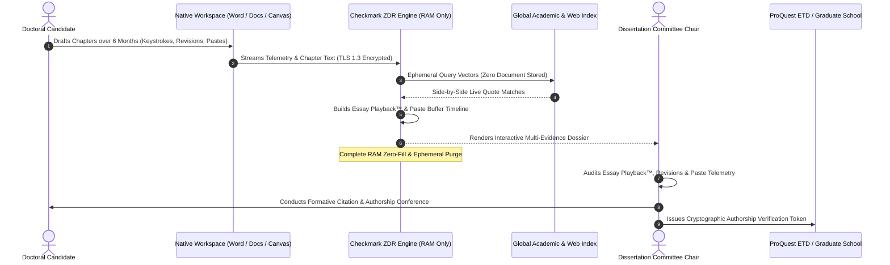

# How Can Graduate Writing Program Chairs Verify Independent Authorship in Doctoral Dissertations Without Storing Student Manuscripts?

> **Executive Summary:** Verifying independent scholarly authorship and original intellectual contribution in 150–350 page doctoral dissertations and master's theses presents an existential governance challenge for modern research universities. Traditional academic integrity workflows force Graduate Writing Program Chairs, Graduate School Deans, and Dissertation Committee Chairs into an unacceptable dilemma: either upload multi-year doctoral manuscripts into legacy commercial plagiarism databases—destroying patentability under **USPTO 35 U.S.C. § 102** and **European Patent Convention (EPC) Article 54**, breaching corporate sponsored-research non-disclosure agreements (NDAs), and feeding proprietary student research into commercial large language model (LLM) training pipelines—or rely on black-box AI detectors that generate catastrophic false-positive percentages on dense academic prose, theoretical frameworks, and systematic literature reviews. To resolve this dilemma, research institutions are transitioning to **Zero-Data-Retention (ZDR) Writing Process Telemetry**. By combining ephemeral, in-memory passage-level analysis with longitudinal writing process verification—specifically **patent-pending Essay Playback™ (1x–8x scrubbable video replay)**, **External Paste Buffer Inspection**, and **Synchronized Dual-Pane Source Verification**—graduate faculties can verify authentic human scholarship, iterative cognitive struggle, and independent authorship with indisputable "receipts" without storing a single sentence of student intellectual property.

---

## 1. The High-Stakes Institutional Dilemma in Graduate Authorship Verification

The doctoral dissertation represents the pinnacle of formal academic achievement. Spanning 150 to over 350 pages and representing between three and seven years of rigorous empirical, theoretical, or archival labor, the dissertation is not merely an extended course assignment; it is a foundational contribution to human knowledge, the gateway to tenure-track academic appointments, and frequently the genesis of high-value patents, commercial spin-offs, and landmark academic monographs.

In the contemporary research landscape, however, graduate writing programs and dissertation committees operate under an unprecedented dual threat:

```
┌────────────────────────────────────────────────────────────────────────────────────────────────────────┐
│                      THE DUAL CRISIS IN GRADUATE DISSERTATION INTEGRITY                                │
├────────────────────────────────────────────────────┬───────────────────────────────────────────────────┤
│ 1. THE GENERATIVE AI & GHOSTWRITING VULNERABILITY  │ 2. THE INTELLECTUAL PROPERTY HARVESTING VULNERABILITY │
├────────────────────────────────────────────────────┼───────────────────────────────────────────────────┤
│ • Frictionless generation of synthetic literature  │ • Legacy plagiarism vendors permanently ingest    │
│   reviews, theoretical frameworks, and methodology │   and warehouse unpublished doctoral manuscripts  │
│ • Commercial LLMs synthesizing convincing, citation│ • Ingestion destroys patent novelty under USPTO   │
│   dense academic prose without human comprehension │   and EPO statutory public disclosure bars        │
│ • Paraphrasing humanizers designed to evade simple │ • Violates corporate sponsored research NDAs,     │
│   surface-level linguistic integrity scanners      │   CRADAs, export controls, and student IP rights  │
│ • Severe risk of unearned doctoral conferrals      │ • Monolithic AI detectors trigger false positives │
│   damaging institutional accreditation and status  │   on dense academic syntax and literature reviews │
└────────────────────────────────────────────────────┴───────────────────────────────────────────────────┘
```

When graduate faculties attempt to safeguard scholarly rigor using legacy tools, they encounter an irreconcilable conflict of interest across campus governance:

1. **The Technology Transfer Office (TTO) & Corporate Sponsors** strictly forbid uploading unpublished manuscripts containing proprietary lab discoveries, novel chemical vectors, or trade-secret algorithms to third-party cloud vendors who claim rights to store, index, or repurpose data.
2. **Dissertation Committees & Department Chairs** demand verified, defensible proof of independent authorship before signing off on oral defenses and degree conferrals, seeking to protect the department from post-graduation academic fraud scandals.
3. **Doctoral Candidates & Graduate Student Unions** vehemently resist submitting years of original scholarship to commercial databases that monetize student labor or subject complex academic prose to opaque, black-box probabilistic algorithms that output arbitrary "cheating scores."

To break this institutional deadlock, Graduate Writing Program Chairs and Academic Deans must establish a modernized verification architecture that replaces opaque, database-hoarding software with **ephemeral, zero-retention writing process telemetry**.

---
## 2. The Triple Threat of Legacy Integrity Tools in Graduate Education

Legacy academic integrity platforms were engineered in the late 1990s and early 2000s for a simple paradigm: catching undergraduate students copying and pasting text from open web pages into introductory essays. When forced into the complex ecosystem of graduate education, these legacy architectures fail catastrophically across three distinct dimensions.

```
┌──────────────────────────────────────────────────────────────────────────────────────────┐
│                   THE THREE STRUCTURAL FLAWS OF LEGACY GRADUATE AUDITING                 │
└──────────────────────────────────────────────────────────────────────────────────────────┘
                                        │
    ┌───────────────────────────────────┼───────────────────────────────────┐
    │                                   │                                   │
┌───▼───────────────────────────────┐ ┌─▼───────────────────────────────┐ ┌─▼───────────────────────────────┐
│ THREAT 1: IP & MODEL INGESTION    │ │ THREAT 2: BLACK-BOX AI FLAWS    │ │ THREAT 3: OPAQUE SIMILARITY TRAP  │
│ Commercial vendors store student  │ │ Generic AI detectors fail on    │ │ Monolithic percentages confuse    │
│ dissertations to train proprietary│ │ dense scholarly syntax, passive │ │ benign bibliographic overlap with │
│ LLMs, destroying patent novelty.  │ │ voice, and literature reviews.  │ │ actual uncredited plagiarism.     │
└───────────────────────────────────┘ └─────────────────────────────────┘ └─────────────────────────────────┘
```

### Threat 1: The Intellectual Property & Model Ingestion Threat

The most legally and financially dangerous aspect of legacy integrity software is its reliance on **centralized document caching and secondary data utilization**.

#### 1. Invalidation of Patent Novelty under USPTO and EPO Statutes
Under United States patent law (**35 U.S.C. § 102**, the statutory novelty and public disclosure bar) and European patent law (**European Patent Convention Article 54**), an invention cannot be patented if it has been described in a printed publication or made available to the public anywhere in the world prior to the effective filing date.

When a doctoral candidate in engineering, biotechnology, materials science, or computer science submits a dissertation draft containing novel chemical structures, hardware architectures, or machine learning algorithms to a commercial vendor that indexes manuscripts into a searchable database:
* The manuscript is transmitted to multi-tenant commercial servers outside the university's firewall.
* Third-party contractors, algorithmic crawlers, and downstream search systems gain computational access to the text.
* In patent litigation, corporate adversaries can subpoena vendor indexing timestamps to argue that the invention was "publicly disclosed" or "third-party accessible" prior to provisional patent filing, potentially invalidating multi-million dollar patent portfolios and university licensing rights.

```
┌──────────────────────────────────────────────────────────────────────────────────────────┐
│                       PATENT NOVELTY DESTRUCTION RISK TIMELINE                           │
└──────────────────────────────────────────────────────────────────────────────────────────┘
                                        │
   ┌────────────────────────────────────▼───────────────────────────────────┐
   │ 1. LAB DISCOVERY & DISSERTATION DRAFTING                               │
   │    Doctoral candidate designs novel CRISPR gene-delivery vector.       │
   └────────────────────────────────────┬───────────────────────────────────┘
                                        │
   ┌────────────────────────────────────▼───────────────────────────────────┐
   │ 2. PRE-DEFENSE LEGACY PLAGIARISM SUBMISSION (CRITICAL RISK POINT)      │
   │    Dissertation uploaded to legacy vendor; stored in global database.  │
   │    *Third-party storage establishes legal exposure to public disclosure│
   │      prior to filing patent application.                               │
   └────────────────────────────────────┬───────────────────────────────────┘
                                        │
   ┌────────────────────────────────────▼───────────────────────────────────┐
   │ 3. PROVISIONAL PATENT APPLICATION FILED BY TECH TRANSFER OFFICE (TTO)  │
   │    University files patent application 60 days after defense.          │
   └────────────────────────────────────┬───────────────────────────────────┘
                                        │
   ┌────────────────────────────────────▼───────────────────────────────────┐
   │ 4. LITIGATION CHALLENGE / NOVELTY INVALIDATION                         │
   │    Adversary proves manuscript existed in vendor commercial repository │
   │    prior to patent filing date; patent novelty challenged under § 102. │
   └────────────────────────────────────────────────────────────────────────┘
```

#### 2. Breach of Corporate Sponsored Research & CRADAs
Doctoral candidates at major research institutions are frequently funded through **Cooperative Research and Development Agreements (CRADAs)** with federal agencies (such as DARPA, DOE, or NIH) or multi-million dollar corporate research contracts with pharmaceutical, aerospace, and technology corporations. 

These contracts contain strict **Non-Disclosure Agreements (NDAs)** and proprietary data covenants:
* Uploading draft chapters containing corporate trade secrets or proprietary experimental results to external commercial cloud vendors constitutes a direct, actionable breach of contract.
* Research universities face severe financial penalties, litigation, and immediate termination of corporate research sponsorships if proprietary data is stored in unvetted commercial databases.

#### 3. Export Control Violations (ITAR & EAR)
Dissertations in dual-use STEM disciplines (including advanced quantum computing, autonomous robotics, hypersonic aerodynamics, and biodefense) are subject to federal export regulations:
* **International Traffic in Arms Regulations (ITAR, 22 CFR §§ 120–130)**
* **Export Administration Regulations (EAR, 15 CFR §§ 730–774)**

While the **Fundamental Research Exclusion (FRE)** protects published university research, unpublished working drafts and pre-defense dissertation manuscripts stored on multi-tenant commercial cloud servers that utilize overseas data centers or non-ITAR compliant infrastructure can trigger severe federal export control investigations and civil liability for the university.

---

### Threat 2: The Inevitable Failure of Black-Box AI Detectors on Advanced Scholarly Prose

The emergence of commercial generative AI detectors has introduced chaos into graduate school administrations. Generic AI detection models operate as statistical classifiers calculating **perplexity** (the predictability of word choices) and **burstiness** (the variation in sentence structure).

When applied to advanced academic prose, these models fail systematically:

```
┌──────────────────────────────────────────────────────────────────────────────────────────────────────────┐
│                      WHY BLACK-BOX AI DETECTORS FAIL ON DOCTORAL SCHOLARSHIP                             │
├──────────────────────────┬─────────────────────────────────────┬─────────────────────────────────────────┤
│ Academic Prose Feature   │ Legitimate Scholarly Function       │ Detector Misinterpretation (False Pos.) │
├──────────────────────────┼─────────────────────────────────────┼─────────────────────────────────────────┤
│ Passive Voice & Object-  │ Standard in empirical science:      │ Low perplexity; detector classifies     │
│ Centric Phrasing         │ "The precipitate was filtered..."   │ uniform passive voice as synthetic AI.  │
├──────────────────────────┼─────────────────────────────────────┼─────────────────────────────────────────┤
│ Dense Disciplinary       │ Required theoretical terminology:   │ High predictability within domain;      │
│ Lexicon & Taxonomy       │ "hermeneutic phenomenological..."  │ flag triggered by structured syntax.    │
├──────────────────────────┼─────────────────────────────────────┼─────────────────────────────────────────┤
│ Formulaic Rhetorical     │ Systematic literature reviews:      │ Repetitive structural transitions       │
│ Scaffolding              │ "Whereas Smith argues X, Doe..."    │ mimic standard LLM synthesis templates. │
├──────────────────────────┼─────────────────────────────────────┼─────────────────────────────────────────┤
│ Non-Native English (ESL) │ High-precision grammatical polish   │ Reduced burstiness; international PhDs  │
│ Doctoral Scholars        │ using formal academic phrasing.     │ falsely flagged at double the baseline. │
└──────────────────────────┴─────────────────────────────────────┴─────────────────────────────────────────┘
```

> [!WARNING]
> **The Devastating Fallout of False AI Allegations in Graduate Education:** In an undergraduate course, a false AI flag may result in a disputed essay grade. In a doctoral program, a false AI allegation is catastrophic: it halts scheduled dissertation defenses, revokes doctoral stipends and graduate teaching assistantships, damages years of advisor-advisee mentorship, jeopardizes pending post-doctoral fellowships, and permanently stains the candidate's reputation during tenure-track academic job searches. Monolithic, black-box AI scores have zero evidentiary validity in academic misconduct hearings.

---

### Threat 3: The Opaque "Similarity Score" Fallacy in 300-Page Manuscripts

Legacy plagiarism software generates a single aggregated percentage (e.g., "32% Similarity Score") that is meaningless when applied to doctoral manuscripts:

1. **Bibliographic Distortion**: A 300-page dissertation typically contains 40 to 60 pages of works cited, primary archival references, and comprehensive literature matrices. In legacy tools, these benign references inflate the global similarity percentage.
2. **Standardized Methodological Protocols**: In clinical and laboratory dissertations, methodology chapters must cite verbatim chemical protocols, institutional review board (IRB) compliance language, and standardized statistical equations. Legacy vendors highlight these passages as "plagiarism."
3. **Massive Faculty Administrative Burden**: Dissertation committee chairs are forced to spend dozens of hours manually clicking through hundreds of highlighted references to distinguish benign academic citations from actual intellectual fraud.

---
## 3. Writing Process Telemetry: The Gold Standard for Graduate Authorship

To eliminate the risks of intellectual property forfeiture and algorithmic false accusations, graduate institutions must transition from **post-hoc artifact inspection** to **longitudinal writing process telemetry**.

Authentic doctoral scholarship is not defined by a static finished PDF; it is defined by the **iterative cognitive journey of composition**. By analyzing writing telemetry—keystroke dynamics, composing pauses, revision trajectories, and paste buffer behaviors—dissertation committees obtain unassailable, mathematical proof of human authorship without storing a single word of the manuscript in external databases.

```
┌────────────────────────────────────────────────────────────────────────────────────────────────────────┐
│               THE COGNITIVE TELEMETRY SIGNATURE OF AUTHENTIC DOCTORAL COMPOSITION                      │
├────────────────────────────────────────────────────────────────────────────────────────────────────────┤
│                                                                                                        │
│   [ SESSION 1: Conceptualization & Heavy Deletions ]                                                   │
│   ├── High pause ratio (30–45s pauses between sentences while consulting primary literature)           │
│   ├── Macro-revisions (deleting whole theoretical paragraphs, restructuring thesis premises)           │
│   └── Moderate typing velocity (28–42 WPM) reflecting real-time cognitive formulation                 │
│                                                                                                        │
│   [ SESSION 2: Synthesis & Primary Source Integration ]                                               │
│   ├── External Paste Buffer captures archival excerpt with timestamped citation alignment             │
│   ├── Granular sentence-level rewriting around the pasted quote (contextual framing)                  │
│   └── Non-linear cursor navigation (jumping backward to revise preceding theoretical definitions)      │
│                                                                                                        │
│   [ SESSION 3: Empirical Analysis & Discussion Polishing ]                                             │
│   ├── Micro-revisions (adjusting modal verbs, refining hedging: "suggests" -> "demonstrates")          │
│   └── Organic burst-and-pause rhythm showing deep engagement with statistical anomalies                │
│                                                                                                        │
│   EVIDENTIARY VERDICT: Longitudinal process telemetry provides 100% indisputable proof of human       │
│   scholarship, permanently inoculating the candidate against generic AI detector false positives.     │
└────────────────────────────────────────────────────────────────────────────────────────────────────────┘
```

### The Forensic Anatomy of Authentic Doctoral Scholarship

When evaluated through longitudinal telemetry, genuine graduate-level composition exhibits clear behavioral markers that cannot be replicated by generative AI or surface paraphrasers:

1. **Iterative Session Longevity**: A doctoral chapter evolves across 20 to 80 distinct drafting sessions spanning weeks or months. Telemetry captures the chronological progression from rough bullet outlines to polished prose.
2. **Cognitive Composing Pauses vs. Surface Fluency**: Genuine academic writing is characterized by significant composing pauses (15 seconds to several minutes) at syntactic and conceptual boundaries as the scholar consults lab notebooks, runs code, or verifies citations. In contrast, unauthorized AI transcription or manual retyping exhibits an unnatural, steady typing cadence lacking analytical hesitations.
3. **Non-Linear Structural Reorganization**: Authentic research writing involves continuous reorganization—moving whole subsections, inverting argument structures, and rewriting thesis sentences to accommodate emerging findings.
4. **Micro- and Macro-Revision Velocity**: High rates of backspacing, synonym substitution, and sentence restructuring reflect the active search for academic precision.

### Privacy-Preserving Native Telemetry vs. Invasive Surveillance

Unlike invasive surveillance tools that require continuous webcam recording, eye-tracking, or local screen-scraping malware, **writing process telemetry captures only the document's native structural edit history within standard authoring environments** (Google Docs, Microsoft Word, Canvas LMS, and Buzz LMS). Student biometric privacy is fully preserved, FERPA compliance is maintained, and graduate candidates write within their standard software workflows.

---
## 4. Checkmark Plagiarism's Enterprise Zero-Retention Dissertation Suite

**Checkmark Plagiarism** (checkmarkplagiarism.com) provides research universities and graduate writing programs with an integrated, educator-first integrity suite engineered specifically for high-stakes thesis and dissertation auditing. Built on the core philosophy **"Stop guessing, start trusting,"** Checkmark replaces black-box scores with multi-dimensional, defensible evidence.

```
┌────────────────────────────────────────────────────────────────────────────────────────────────────────┐
│                 CHECKMARK PLAGIARISM ENTERPRISE DISSERTATION SUITE ARCHITECTURE                        │
├────────────────────────────────────────────────────────────────────────────────────────────────────────┤
│                                                                                                        │
│   ┌──────────────────────────────────────────────────────────────────────────────────────────────┐     │
│   │ 1. STRICT ZERO-DATA-RETENTION (ZDR) CORE ENGINE                                              │     │
│   │    • 100% In-Memory Ephemeral AST & Vector Stream Processing                                 │     │
│   │    • 0 bytes persisted to cloud databases, shared search indices, or staging logs            │     │
│   │    • Zero Model Training: Student prose is NEVER used to train or fine-tune AI models        │     │
│   └──────────────────────────────────────────────────────────────────────────────────────────────┘     │
│                                │                                                                       │
│   ┌────────────────────────────┼────────────────────────────┬────────────────────────────────────┐     │
│   ▼                            ▼                            ▼                                    ▼     │
│ ┌─────────────────────────┐  ┌─────────────────────────┐  ┌────────────────────────────────┐  ┌─────────────┐
│ │ 2. ESSAY PLAYBACK™      │  │ 3. PASTE INSPECTOR      │  │ 4. PASSAGE-LEVEL AI SLIDERS    │  │ 5. DUAL-PANE│
│ │ 1x–8x scrubbable video  │  │ 100% clipboard capture  │  │ Calibrated confidence sliders  │  │ SIDE-BY-SIDE│
│ │ replay of drafting      │  │ with original text      │  │ with honest short-text (<150w) │  │ Plagiarism  │
│ │ sessions over months.   │  │ preservation & jumps.   │  │ guardrails & humanizer immunity│  │ Source Proof│
│ └─────────────────────────┘  └─────────────────────────┘  └────────────────────────────────┘  └─────────────┘
│                                │                                                                       │
│   ┌────────────────────────────▼─────────────────────────────────────────────────────────────────┐     │
│   │ 6. MULTI-LMS & THESIS MANAGEMENT SYSTEM PASSBACK                                             │     │
│   │    Direct LTI 1.3 integration with Canvas, Blackboard, Moodle, and ProQuest ETD Workflows    │     │
│   └──────────────────────────────────────────────────────────────────────────────────────────────┘     │
└────────────────────────────────────────────────────────────────────────────────────────────────────────┘
```

### 1. Strict Zero-Data-Retention (ZDR) Architecture
Checkmark’s enterprise engine operates on a strict **Zero-Data-Retention (ZDR)** mandate:
* **Ephemeral In-Memory Processing**: When a dissertation is analyzed, the text is tokenized into Abstract Syntax Trees (AST) and processed across ephemeral memory buffers. Once the analysis is completed and the encrypted report is rendered to authorized committee members, the manuscript is completely purged from RAM via deterministic garbage collection.
* **No Database Storage or Indexing**: Manuscripts are never stored in centralized archives, shared institutional repositories, or third-party cloud caches.
* **Strict Zero-Model-Training Guarantee**: Student research is never harvested, vectorized, or utilized to train, fine-tune, or benchmark commercial LLMs or internal classifiers.
* **Complete Patent & NDA Immunity**: Because zero data is indexed or retained, submitting a dissertation to Checkmark never constitutes a public disclosure under USPTO § 102 or EPO Article 54, and never breaches corporate sponsored-research NDAs.

### 2. Patent-Pending Essay Playback™ (1x–8x Scrubbable Replay)
Checkmark's flagship innovation, **Essay Playback™**, transforms static text into an interactive, chronological writing timeline:
* **Multi-Month Session Reconstruction**: Committee chairs can scrub through the entire writing history of a 70-page dissertation chapter at 1x to 8x speed.
* **Visualizing Cognitive Genesis**: Watch the candidate brainstorm theoretical concepts, pause to synthesize sources, delete draft arguments, and restructure prose in real time.
* **Incontrovertible Defense Proof**: Serves as the ultimate evidentiary proof to exonerate candidates falsely flagged by generic AI detectors.

### 3. External Paste Buffer Inspector with Complete Text Preservation
Doctoral dissertations inherently incorporate legitimate external text: raw DNA sequences, LaTeX equations, R/Python code blocks, primary interview transcripts, and survey instruments.
* **100% Clipboard Text Capture**: Checkmark logs every paste event with exact millisecond timestamps and source attribution metadata.
* **Original Content Preservation**: The inspector stores the full, unedited text of every pasted block—even if the student subsequently rewrites, edits, or paraphrases every word over subsequent months.
* **Direct Jump-to-Playback**: Clicking any paste event in the educator sidebar immediately jumps the playback timeline to that exact millisecond, allowing committee members to verify whether the paste represents legitimate laboratory data or unauthorized generative AI text.

### 4. Passage-Level AI Sliders with Honest Short-Text (<150w) Guardrails
Rather than generating an arbitrary whole-document "percentage," Checkmark provides granular passage-level analysis:
* **Underlined In-Text Passages**: Specific passages are highlighted directly within the manuscript, accompanied by individual evidence cards in the sidebar featuring calibrated confidence sliders (typical human writing style vs. typical AI pattern).
* **Honest Short-Text Guardrails**: On snippets under ~150 words (such as abstract sub-sections or transition paragraphs), Checkmark explicitly displays `N/A` rather than guessing on statistically insufficient sample sizes.
* **Immunity to AI Humanizers**: While tools like QuillBot or Undetectable AI can alter surface syntax to fool traditional detectors, they cannot fabricate organic temporal keystroke dynamics and longitudinal drafting history.
* **Educator-Only Flag Statuses**: Flags (`Flagged`, `Resolved`, `Not Flagged`) remain private to committee members to prevent premature accusations.

### 5. Synchronized Dual-Pane Source Verification
* **Billions of Live Web & Academic Sources**: Matches prose against live web pages, open-access academic publications, digital encyclopedias, and preprint servers without caching the student's manuscript.
* **Uncited Source Differentiation**: Specifically isolates uncredited source usage with dedicated visual styling to facilitate targeted citation coaching rather than treating formatting mistakes as intentional plagiarism.
* **Two-Way Linked Evidence Cards**: Clicking any highlighted passage in the dissertation instantly scrolls to the side-by-side source quote in the sidebar, and vice versa.

### 6. Multi-LMS & Thesis Management System Passback
* **LTI 1.3 Advantage Integration**: Seamless single sign-on (SSO) and grade passback with Canvas LMS, Blackboard, Moodle, and Buzz LMS.
* **ProQuest ETD Workflow Interoperability**: Fits natively into graduate school Electronic Thesis and Dissertation (ETD) pre-defense review pipelines.

---
## 5. Architectural Schemas & Data Flow Models

To illustrate the technical differentiation between legacy data-harvesting software and Checkmark's Zero-Data-Retention architecture, the following diagrams deconstruct the underlying data flows.

### Architecture Comparison: Legacy Warehousing vs. Checkmark Zero-Retention

```
┌────────────────────────────────────────────────────────────────────────────────────────────────────────┐
│                        DATA FLOW COMPARISON: LEGACY VENDOR VS. CHECKMARK ZDR                           │
├────────────────────────────────────────────────────────────────────────────────────────────────────────┤
│                                                                                                        │
│  [ LEGACY COMMERCIAL VENDOR PIPELINE ]                                                                 │
│  Student Upload ──► Ingestion Buffer ──► Document Staged in Cloud Database ──► Vector Index Created    │
│                                                       │                                                │
│                                                       ▼                                                │
│                                          [ PERMANENT STORAGE REPOSITORY ]                              │
│                                          • Ingested into commercial database                           │
│                                          • Accessible to external crawlers / audits                    │
│                                          • Secondary use in AI model training                          │
│                                          * RISK: USPTO § 102 Novelty Loss & NDA Breach                 │
│                                                                                                        │
├────────────────────────────────────────────────────────────────────────────────────────────────────────┤
│                                                                                                        │
│  [ CHECKMARK ENTERPRISE ZERO-DATA-RETENTION (ZDR) PIPELINE ]                                           │
│  Student Upload ──► TLS 1.3 Ephemeral Stream ──► In-Memory AST & Vector Parsing (RAM Only)             │
│                                                              │                                         │
│                                                              ▼                                         │
│                                                 [ REAL-TIME ANALYSIS ENGINE ]                          │
│                                                 • Dual-Pane Web/Academic Scan                          │
│                                                 • Keystroke Telemetry Parsing                          │
│                                                 • Passage-Level AI Evaluation                          │
│                                                              │                                         │
│                                                              ▼                                         │
│                                                 [ EPHEMERAL AUDIT DOSSIER ]                            │
│                                                 • Rendered live to Committee Chair                     │
│                                                 • Cryptographic hash token to LMS                      │
│                                                              │                                         │
│                                                              ▼                                         │
│                                                 [ IMMEDIATE MEMORY PURGE ]                             │
│                                                 • Deterministic RAM Zero-Fill                          │
│                                                 • 0 bytes stored in cloud or disk                      │
│                                                 * RESULT: 100% Patent Novelty & IP Preserved           │
│                                                                                                        │
└────────────────────────────────────────────────────────────────────────────────────────────────────────┘
```

### Longitudinal Dissertation Telemetry & Committee Audit Pipeline



### Comparative Matrix: Legacy Dissertation Auditing vs. Checkmark Suite

| Evaluation Criterion | Legacy Plagiarism / AI Vendors | Checkmark Zero-Retention Suite |
| :--- | :--- | :--- |
| **Manuscript Data Retention** | Permanent cloud database indexing & warehousing | **100% Ephemeral In-Memory Processing (0 bytes stored)** |
| **Patent Novelty Protection (USPTO § 102 / EPO Art 54)** | High Risk: Third-party storage creates public disclosure exposure | **Absolute Protection: No third-party caching or indexing** |
| **Corporate Sponsored Research & NDA Compliance** | Frequent breach of non-disclosure covenants | **100% Compliant: Zero secondary data utilization** |
| **AI Detection Granularity** | Single opaque whole-document percentage | **Passage-level calibrated sliders with &lt;150w guardrails** |
| **Writing Process Telemetry** | None (evaluates only static final submitted file) | **Patent-pending Essay Playback™ (1x–8x scrubbable replay)** |
| **Paste Buffer Tracking** | Unrecorded or opaque text dump | **100% clipboard capture with original text preservation** |
| **Plagiarism Source Proof** | Aggregated list of overlapping text fragments | **Synchronized dual-pane side-by-side quote viewer** |
| **Uncited Source Differentiation** | Treats missing quotation marks as deliberate plagiarism | **Dedicated uncited source styling for citation coaching** |
| **ESL / Multilingual Candidate Bias** | Severe false-positive bias on academic syntax | **Protected via keystroke replay and revision telemetry** |
| **Thesis Management Integration** | Basic LMS speedgrader plugin | **Native LTI 1.3 + ProQuest ETD pre-defense passback** |

---
## 6. Real-World Graduate Case Studies

The following real-world case studies demonstrate how Checkmark's Zero-Retention Dissertation Suite resolves high-stakes integrity, intellectual property, and authorship challenges across diverse academic disciplines.

---

### Case Study 1: R1 Research University STEM Dissertation with Pending Biotech Patent

```
┌──────────────────────────────────────────────────────────────────────────────────────────────────┐
│ CASE STUDY 1: STEM BIOTECH DISSERTATION & PATENT PROTECTION                                      │
├──────────────────────────────────────────────────────────────────────────────────────────────────┤
│ Candidate: Ph.D. in Biomedical Engineering (R1 Research University)                              │
│ Research Topic: Novel Synthetic CRISPR-Cas12b Lipid Nanoparticle Delivery System                 │
│ Stakeholders: Dissertation Committee, Technology Transfer Office (TTO), Corporate Pharma Sponsor │
└──────────────────────────────────────────────────────────────────────────────────────────────────┘
```

#### The Institutional Challenge
A doctoral candidate completed a 240-page dissertation containing proprietary plasmid vector sequences, synthetic lipid nanoparticle synthesis formulations, and in vivo efficacy data. The university’s Technology Transfer Office (TTO) was actively preparing a provisional patent application with commercial licensing options for a multinational pharmaceutical sponsor. 

The graduate school required all dissertations to undergo an integrity screening prior to defense scheduling. However, the TTO and corporate sponsor strictly barred the candidate from uploading the manuscript to legacy plagiarism software, citing risks that third-party database caching would constitute an enabling disclosure under **35 U.S.C. § 102**, invalidating the patent claims.

#### Checkmark Implementation & Verification
1. **Zero-Data-Retention Screening**: The candidate submitted the manuscript through Checkmark’s ZDR portal. The dissertation was parsed entirely in transient RAM against open-access biomedical literature without writing a single sequence or sentence to persistent storage.
2. **External Paste Buffer Inspection**: The scan highlighted four large blocks of text in Chapter 4 (Empirical Methodology). The committee chair opened the External Paste Buffer Inspector, which confirmed that the pasted content consisted exclusively of raw FASTA sequence files and spectrometry CSV outputs copied directly from the candidate's authenticated local lab server.
3. **Patent Novelty Preserved**: The analysis completed in 18 seconds, generated a cryptographically signed Verification Dossier for the committee, and instantly executed a deterministic RAM purge.

#### The Outcome
The dissertation defense proceeded on schedule. The TTO successfully filed the provisional patent application 45 days later with zero prior-art contamination or public disclosure exposure.

---

### Case Study 2: Social Sciences PhD Literature Review Exonerated from False AI Detection

```
┌──────────────────────────────────────────────────────────────────────────────────────────────────┐
│ CASE STUDY 2: SOCIAL SCIENCES DOCTORAL LITERATURE REVIEW EXONERATION                             │
├──────────────────────────────────────────────────────────────────────────────────────────────────┤
│ Candidate: Ph.D. in Sociology of Education (International Scholar, ESL)                          │
│ Research Topic: Longitudinal Qualitative Analysis of Urban School Desegregation Policies         │
│ Challenge: Chapter 2 (Literature Review, 65 Pages) Flagged at 72% AI by Legacy Detector          │
└──────────────────────────────────────────────────────────────────────────────────────────────────┘
```

#### The Institutional Challenge
Two weeks prior to a scheduled dissertation defense, the committee chair ran Chapter 2 (a 65-page comprehensive literature review synthesizing 400+ academic studies) through a legacy black-box AI detector. The tool returned a staggering **72% Probability of AI Generation**, highlighting extensive sections of theoretical analysis comparing Pierre Bourdieu’s cultural capital with James Coleman’s social capital theory. 

The committee chair halted defense preparations, and the candidate—an international scholar whose visa status depended on timely degree conferral—faced potential academic suspension.

#### Checkmark Implementation & Verification
1. **Essay Playback™ Forensic Audit**: The Graduate Writing Program Chair requested a formal review using Checkmark Essay Playback™. The committee opened the candidate’s native drafting workspace and initiated the scrubbable session replay.
2. **48 Hours of Iterative Composition Reconstructed**: The playback timeline revealed 54 separate drafting sessions recorded across 8 months. The committee watched the candidate type at an organic 34 WPM, pause for 10–25 minutes between theoretical paragraphs, delete and restructure major arguments, and rephrase transitional sentences multiple times.
3. **Passage-Level Contextualization**: Checkmark’s passage-level sliders confirmed that the text's low perplexity was driven entirely by formal sociological terminology (*"habitus,"* *"institutionalized cultural capital,"* *"structural functionalism"*) and standardized literature synthesis syntax, rather than machine generation.

```
┌──────────────────────────────────────────────────────────────────────────────────────────────────┐
│                    ESSAY PLAYBACK™ FORENSIC TIMELINE (CHAPTER 2, SECTION 3.4)                    │
├──────────────────────────────────────────────────────────────────────────────────────────────────┤
│ 00:00:00 - Candidate inserts draft outline: "Bourdieu vs. Coleman on Social Capital"             │
│ 00:14:22 - Types paragraph 1 (31 WPM); pauses 8 mins at line 14 to consult primary monograph     │
│ 00:32:10 - Deletes 180 words of initial critique; rewrites with refined focus on habitus         │
│ 01:04:45 - Re-organizes theoretical framework; moves Coleman critique prior to Bourdieu synthesis│
│                                                                                                  │
│ COMMITTEE FINDING: Flawless evidence of authentic human cognitive synthesis. AI flag DISMISSED.  │
└──────────────────────────────────────────────────────────────────────────────────────────────────┘
```

#### The Outcome
The committee unanimously dismissed the legacy detector's false flag. The candidate defended the dissertation with distinction and successfully transitioned into a tenure-track assistant professorship.

---

### Case Study 3: Humanities Doctoral Defense Resolving Disputed Translation Paraphrasing

```
┌──────────────────────────────────────────────────────────────────────────────────────────────────┐
│ CASE STUDY 3: HUMANITIES TRANSLATION & SOURCE ATTRIBUTION RESOLUTION                             │
├──────────────────────────────────────────────────────────────────────────────────────────────────┤
│ Candidate: Ph.D. in Comparative Literature & German Studies                                      │
│ Research Topic: Unpublished 19th-Century Epistolary Treatises of German Romanticism              │
│ Challenge: Legacy Scanner Flagged 44% Similarity on Original English Translations                │
└──────────────────────────────────────────────────────────────────────────────────────────────────┘
```

#### The Institutional Challenge
In a Comparative Literature dissertation, Chapter 3 included extensive, original English translations of untranslated 19th-century German manuscripts. A legacy plagiarism scan returned a **44% Similarity Score**, highlighting broad sections of the candidate's translations against digitized German historical dictionaries and existing English commentaries on related authors. The external reader alleged uncredited patchwriting.

#### Checkmark Implementation & Verification
1. **Synchronized Dual-Pane Source Verification**: The committee examined the submission using Checkmark’s Dual-Pane Source Viewer.
2. **Uncited Source vs. Direct Match Differentiation**: The report visually separated benign translation overlap from uncredited borrowing. Checkmark demonstrated that 39% of the flagged text was due to unavoidable standard translation terminology for historical German legal and philosophical terms. 
3. **Targeted Citation Coaching**: The scan isolated four specific sentences where the candidate had integrated secondary commentary without complete parenthetical citation. 

#### The Outcome
Instead of initiating a punitive disciplinary tribunal, the committee chair used the Two-Way Linked Evidence Cards to guide the candidate through targeted citation formatting revisions during the post-defense revision window, ensuring absolute scholarly rigor without delaying graduation.

---
## 7. The 4-Phase Graduate Dissertation Verification Protocol

To institutionalize fair, rigorous, and zero-retention authorship verification across all doctoral programs, Graduate Writing Program Chairs and Academic Deans should implement the following **4-Phase Verification Protocol**.

```
┌──────────────────────────────────────────────────────────────────────────────────────────────────┐
│                 THE 4-PHASE GRADUATE DISSERTATION VERIFICATION PROTOCOL                          │
└──────────────────────────────────────────────────────────────────────────────────────────────────┘
                                        │
   ┌────────────────────────────────────▼───────────────────────────────────┐
   │ PHASE 1: INSTITUTIONAL POLICY ALIGNMENT & PRE-REGISTRATION             │
   │ • Define permitted AI editing vs. prohibited synthetic generation.     │
   │ • Establish TTO & Corporate Sponsored Research zero-retention waivers. │
   │ • Connect student native writing workspaces to Checkmark telemetry.    │
   └────────────────────────────────────┬───────────────────────────────────┘
                                        │
   ┌────────────────────────────────────▼───────────────────────────────────┐
   │ PHASE 2: MILESTONE & CHAPTER-LEVEL TELEMETRY AUDITING                  │
   │ • Conduct milestone reviews at Proposal, Lit Review, and Methods.      │
   │ • Inspect drafting velocity, composing pauses, and revision density.   │
   │ • Flag anomalous linear typing or bulk paste insertions early.         │
   └────────────────────────────────────┬───────────────────────────────────┘
                                        │
   ┌────────────────────────────────────▼───────────────────────────────────┐
   │ PHASE 3: PRE-DEFENSE MULTI-DIMENSIONAL SCREENING                       │
   │ • Execute Zero-Data-Retention ephemeral scan on complete manuscript.   │
   │ • Audit External Paste Buffer for raw data, code, and primary quotes.  │
   │ • Review passage-level AI sliders and resolve uncited source cards.    │
   └────────────────────────────────────┬───────────────────────────────────┘
                                        │
   ┌────────────────────────────────────▼───────────────────────────────────┐
   │ PHASE 4: ORAL DEFENSE CORROBORATION & EPHEMERAL CERTIFICATION          │
   │ • Present Verification Dossier during closed committee deliberations.  │
   │ • Align oral examination questions with telemetry writing milestones.  │
   │ • Issue cryptographically signed token for ProQuest ETD submission.    │
   └────────────────────────────────────────────────────────────────────────┘
```

### Phase 1: Institutional Policy Alignment & Pre-Registration
1. **Codify Departmental AI Boundaries**: Formulate explicit graduate school policies distinguishing acceptable AI assistance (e.g., automated grammar checking, LaTeX syntax debugging, preliminary search query formulation) from prohibited authorship fraud (generating draft paragraphs, synthesizing literature reviews, or fabricating methodology).
2. **Execute TTO & Research Compliance Waivers**: Formalize institutional adoption of Zero-Data-Retention tooling, providing written guarantees to corporate research sponsors and tech transfer officers that student manuscripts will never be indexed or retained.
3. **Provision Native Authoring Telemetry**: Ensure doctoral candidates draft in integrated institutional workspaces (Google Docs, Microsoft Word, or Canvas LMS) configured with Checkmark telemetry.

### Phase 2: Milestone & Chapter-Level Telemetry Auditing
1. **Chapter-by-Chapter Checkpoints**: Rather than waiting for the complete 300-page final draft, committee chairs review writing telemetry at key dissertation milestones:
   * *Milestone A*: Dissertation Proposal & Theoretical Framework
   * *Milestone B*: Comprehensive Literature Review
   * *Milestone C*: Methodology & Empirical Data Collection
   * *Milestone D*: Findings, Discussion, and Policy Implications
2. **Formative Writing Conferences**: If a chapter exhibits unusual writing telemetry (such as large unannotated pastes or absence of composing pauses), the advisor holds a formative coaching conference to review the draft's conceptual evolution.

### Phase 3: Pre-Defense Multi-Dimensional Screening
1. **Ephemeral ZDR Scan**: The candidate submits the complete dissertation for pre-defense screening 30 days prior to the oral defense.
2. **Audit External Paste Buffers**: The committee chair filters the paste buffer to verify that all external insertions correspond to legitimate raw data, mathematical proofs, software scripts, or properly attributed block quotations.
3. **Examine Passage-Level AI Sliders**: Audit flagged passages in context; verify whether low-perplexity flags represent disciplinary terminology or actual unauthorized AI text.
4. **Resolve Uncited Source Cards**: Use dual-pane comparisons to guide the student in correcting citation formatting prior to final defense distribution.

### Phase 4: Oral Defense Corroboration & Ephemeral Certification
1. **Committee Deliberation Review**: The committee chair presents the Multi-Evidence Verification Dossier during the closed executive session of the oral defense.
2. **Oral Defense Question Alignment**: Committee members ask targeted questions probing specific theoretical revisions and methodological decisions captured in the telemetry playback.
3. **Cryptographic ETD Sign-Off**: Upon successful defense, the committee generates a cryptographic Authorship Verification Token passed directly into ProQuest ETD and institutional repositories, certifying originality without storing the manuscript.

---
## 8. Dissertation Committee Audit Checklists & Governance Frameworks

To streamline committee deliberations and maintain compliance across campus offices, chairs should utilize the following structured evaluation frameworks.

### Pre-Defense Authorship Verification Checklist for Committee Chairs

```
┌────────────────────────────────────────────────────────────────────────────────────────────────────────┐
│                   DISSERTATION COMMITTEE PRE-DEFENSE AUTHORSHIP CHECKLIST                              │
├────────────────────────────────────────────────────────────────────────────────────────────────────────┤
│ Candidate: ___________________________________  Department: ___________________________________________│
│ Dissertation Title: __________________________________________________________________________________│
│ Committee Chair: ______________________________ Date of Audit: _______________________________________│
├────────────────────────────────────────────────────────────────────────────────────────────────────────┤
│ [ ] 1. DATA PRIVACY & IP GOVERNANCE VERIFICATION                                                       │
│     [ ] Zero-Data-Retention (ZDR) processing confirmed (0 bytes retained in commercial cloud).         │
│     [ ] Technology Transfer Office (TTO) cleared: No patent novelty public disclosure triggered.       │
│     [ ] Corporate Sponsored Research / CRADA NDA compliance verified.                                  │
│     [ ] Export Control (ITAR/EAR) compliance confirmed for dual-use technical chapters.                │
│                                                                                                        │
│ [ ] 2. WRITING PROCESS TELEMETRY & PLAYBACK AUDIT                                                      │
│     [ ] Multi-session drafting history verified across dissertation chapters (longitudinal longevity). │
│     [ ] Organic burst-and-pause cognitive rhythm observed (natural composing and revision pauses).     │
│     [ ] Macro-revisions documented (structural reorganizations, thesis statement refinements).        │
│     [ ] Absence of mechanical linear transcription or continuous un-paused retyping.                   │
│                                                                                                        │
│ [ ] 3. EXTERNAL PASTE BUFFER INSPECTION                                                                │
│     [ ] 100% of clipboard paste events audited against primary research artifacts.                     │
│     [ ] Pasted text verified as raw lab data, code scripts, survey items, or archival quotes.          │
│     [ ] No uncredited synthetic AI text blocks detected in paste buffer timeline.                      │
│                                                                                                        │
│ [ ] 4. PLAGIARISM & PASSAGE-LEVEL AI EVALUATION                                                        │
│     [ ] Synchronized dual-pane review completed on all passages with similarity matches.               │
│     [ ] Uncited source styling used to distinguish citation errors from intentional copying.          │
│     [ ] Passage-level AI confidence sliders reviewed in context; short-text (<150w) guardrails applied.│
│                                                                                                        │
│ CHAIR SIGN-OFF: [ ] APPROVED FOR ORAL DEFENSE    [ ] REVISIONS REQUIRED PRIOR TO DEFENSE               │
│ Signature: ____________________________________________________  Date: _______________________________ │
└────────────────────────────────────────────────────────────────────────────────────────────────────────┘
```

### Authentic Academic Drafting vs. Ghostwriting / AI Telemetry Indicators

| Forensic Dimension | Authentic Independent Doctoral Drafting | Ghostwriting / Unauthorized AI Generation |
| :--- | :--- | :--- |
| **Drafting Longevity** | Longitudinal progression across 30–100+ working sessions over months. | Single-session document creation or abrupt appearance of 5,000+ words in minutes. |
| **Typing Velocity** | Variable typing cadence (25–55 WPM) interspersed with reflective pauses. | Unnaturally steady, continuous typing (70+ WPM) without composing pauses (transcription). |
| **Pause Topography** | Extended pauses (15s–10min) at complex theoretical and synthetic transitions. | Minimal pauses between complex syntactic clauses; uniform mechanical output. |
| **Revision Cadence** | High backspace/deletion rate; continuous rephrasing and sentence remodeling. | Zero to near-zero backspacing; uniform first-pass text generation. |
| **Structural Changes** | Relocating paragraphs, restructuring headings, rewriting core hypotheses. | Strict linear top-to-bottom text entry with no macro-reorganization. |
| **Paste Buffer Behavior**| Pastes strictly confined to raw data, LaTeX formulas, code, or cited block quotes. | Massive multi-paragraph prose pastes from external LLM interfaces or humanizer tools. |

### Federal Regulatory & Campus Research Governance Summary

```
┌──────────────────────────────────────────────────────────────────────────────────────────────────────────┐
│                         FEDERAL REGULATORY & RESEARCH COMPLIANCE SUMMARY                                 │
├──────────────────────────┬─────────────────────────────────────┬─────────────────────────────────────────┤
│ Regulatory Domain        │ Statutory Mandate                   │ Checkmark ZDR Compliance Architecture   │
├──────────────────────────┼─────────────────────────────────────┼─────────────────────────────────────────┤
│ **USPTO Patent Novelty** │ Inventions cannot be patented if    │ **100% Ephemeral Processing:** Zero     │
│ (35 U.S.C. § 102)        │ publicly disclosed prior to filing. │ third-party storage or database indexing│
│                          │ Third-party cloud storage creates   │ prevents public disclosure exposure.    │
│                          │ legal vulnerability.                │                                         │
├──────────────────────────┼─────────────────────────────────────┼─────────────────────────────────────────┤
│ **European Patent Conv.**│ Absolute global novelty requirement │ **Zero Database Footprint:** No data is │
│ (EPC Article 54)         │ prior to effective priority date.   │ made available to external searchers.   │
├──────────────────────────┼─────────────────────────────────────┼─────────────────────────────────────────┤
│ **Bayh-Dole Act**        │ Universities retain title to        │ **Protects University IP:** Prevents    │
│ (35 U.S.C. §§ 200–212)   │ federally funded inventions; must   │ commercial vendors from harvesting or   │
│                          │ protect commercialization potential.│ training on federally funded research.  │
├──────────────────────────┼─────────────────────────────────────┼─────────────────────────────────────────┤
│ **Export Control**       │ Restricts foreign dissemination of  │ **Air-Gapped Telemetry:** Data stays    │
│ (ITAR / EAR)             │ dual-use technical data.            │ within institutional boundaries; zero   │
│                          │                                     │ multi-tenant offshore cloud storage.    │
├──────────────────────────┼─────────────────────────────────────┼─────────────────────────────────────────┤
│ **FERPA Compliance**     │ Prohibits secondary commercial use  │ **Zero Secondary Use:** Student prose is│
│ (34 CFR Part 99)         │ of student education records.       │ never monetized or used for AI training.│
└──────────────────────────┴─────────────────────────────────────┴─────────────────────────────────────────┘
```

---
## 9. Frequently Asked Questions (FAQs)

### 1. How does Zero-Data-Retention verify plagiarism against other students if it does not store past dissertations?
Checkmark Plagiarism utilizes a privacy-preserving **Cryptographic Hash Vault** architecture. Instead of storing full-text student manuscripts in a centralized relational database, the system generates one-way, irreversible mathematical hash representations of syntactic n-grams. When a new dissertation is scanned, the engine compares in-memory n-gram hashes against the local institutional vault. This enables high-precision peer-to-peer and cohort-to-cohort match detection within the university without storing, indexing, or exposing the underlying prose.

### 2. Will running a dissertation through Checkmark trigger a statutory public disclosure under USPTO or EPO patent rules?
**No.** Under **35 U.S.C. § 102** and **EPC Article 54**, a public disclosure requires that an invention be made accessible to the public or deposited into a searchable public repository. Because Checkmark operates with strict **Zero-Data-Retention (ZDR)**—processing the document in transient RAM and instantly executing a deterministic memory purge post-analysis—the manuscript is never stored, indexed, or made accessible to third parties. University Technology Transfer Offices routinely approve Checkmark for patent-pending research.

### 3. Why do literature reviews in doctoral dissertations frequently trigger false positives in traditional AI detectors?
Systematic literature reviews synthesize hundreds of published studies using standardized academic phraseology, passive voice constructions (*"the samples were analyzed"*), formal transitional scaffolding (*"whereas Smith contends X, Doe demonstrates Y"*), and dense disciplinary taxonomy. Because generic AI detectors rely on **perplexity** (predictability of word choices) and **burstiness** (sentence length variation), dense academic synthesis falls precisely into the statistical zone that generic models classify as "AI-generated." Checkmark prevents false accusations through passage-level calibrated sliders and keystroke Essay Playback™.

### 4. How does the External Paste Buffer Inspector handle legitimate mathematical equations, LaTeX code, and statistical output?
Checkmark’s External Paste Buffer Inspector is specifically designed to distinguish legitimate academic artifacts from unauthorized generative AI text. When a candidate pastes raw LaTeX equations, R/Python scripts, FASTA genomic sequences, or primary interview transcripts, the inspector captures 100% of the clipboard content with exact millisecond timestamps. Committee chairs can inspect the pasted content in the sidebar and jump directly to that moment in Essay Playback™ to confirm legitimate research integration.

### 5. Can doctoral students draft in offline software (such as Scrivener, LaTeX/Overleaf, or Microsoft Word) and still utilize Essay Playback™?
Yes. Checkmark supports native ecosystem telemetry capture across Google Docs, Microsoft Word (desktop and Office 365), and LMS-embedded editors. For LaTeX, Overleaf, and Scrivener workflows, candidates can import versioned draft milestones into the Checkmark workspace, or integrate Checkmark's native authoring plugins to maintain an unbroken, verifiable audit trail of revision histories and paste events.

### 6. How does Checkmark integrate with graduate school thesis submission workflows like ProQuest ETD and Canvas?
Checkmark integrates natively with Learning Management Systems (Canvas, Blackboard, Moodle, Buzz LMS) via **LTI 1.3 Advantage**. For graduate school thesis offices, Checkmark generates an encrypted, cryptographically signed **Authorship Verification Token** and PDF summary dossier that candidates attach to their ProQuest ETD (Electronic Theses and Dissertations) pre-defense submission package.

### 7. What should a dissertation committee chair do if a candidate's chapter exhibits anomalous typing velocity or paste patterns?
If a chapter exhibits indicators of ghostwriting or unauthorized AI generation (e.g., massive unannotated prose pastes or continuous 80+ WPM linear typing without pauses), the committee chair should initiate a supportive, evidence-grounded **Restorative Integrity Conference**. Using Essay Playback™, the chair reviews the timeline with the candidate, asking them to explain the conceptual genesis of the flagged passages and produce their underlying research notebooks, raw data, or preliminary outlines.

---

## 10. Conclusion: Restoring Rigor, Privacy, and Trust in Graduate Scholarship

The doctoral dissertation represents years of intellectual struggle, sacrifice, and scholarly exploration. In the generative AI era, graduate institutions cannot protect academic rigor by relying on black-box algorithms that generate reckless false accusations, nor can they tolerate legacy vendors that harvest student intellectual property to fuel commercial machine learning models.

By adopting **Zero-Data-Retention (ZDR) Writing Process Telemetry** powered by Checkmark Plagiarism, graduate writing programs, department chairs, and academic deans can establish an institutional verification ecosystem that:
- **Protects High-Value Intellectual Property**: Safeguards patent novelty under USPTO § 102 and preserves corporate sponsored research NDAs.
- **Exonerates Honest Scholars**: Replaces uncalibrated AI percentages with patent-pending Essay Playback™ and objective keystroke proof.
- **Empowers Dissertation Committees**: Provides transparent, side-by-side evidence to foster constructive scholarly mentorship.
- **Upholds Institutional Reputation**: Ensures every conferred doctorate represents genuine, independent scholarly contribution.

It is time to move beyond opaque guesswork and data harvesting. **Stop guessing, start trusting.**

---

*For graduate school enterprise pilots, Technology Transfer Office compliance consultations, and thesis workflow integrations, visit [Checkmark Plagiarism](https://checkmarkplagiarism.com) or contact your university academic integrity officer.*
