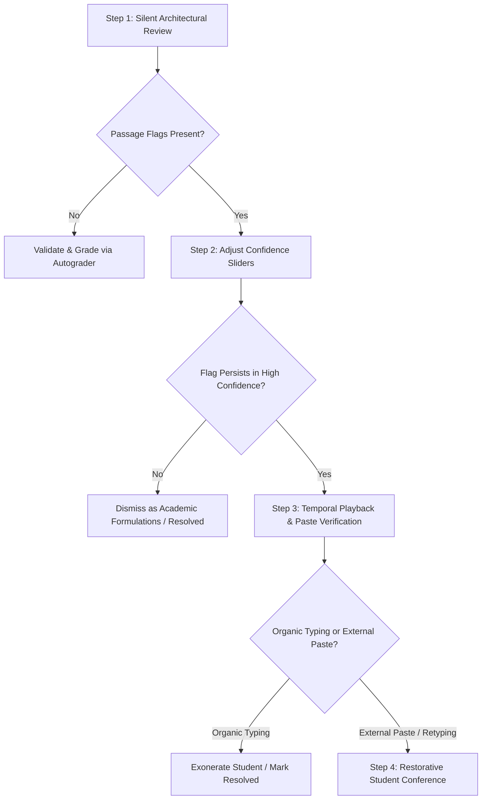

# How Do Passage-Level AI Confidence Sliders Prevent False Accusations in Hybrid Student Drafts?

> **Executive Summary:** The binary paradigm of student writing—where an essay was either 100% human-crafted or 100% plagiarized—is obsolete. Today's K-12 and higher education classrooms operate in a **hybrid writing reality**: students legitimately use artificial intelligence for brainstorming, topic exploration, and grammar refinement, while occasionally inserting unapproved machine-generated paragraphs under time pressure. When legacy academic integrity tools summarize complex multi-page drafts with a single, opaque document percentage (e.g., *"42% AI Detected"*), they create an untenable administrative crisis. These aggregate scores commit a dangerous dual error: they falsely accuse honest students whose authentic prose is mathematically averaged with standard phrasing, while failing to provide actionable evidence for isolated AI insertions. **Checkmark Plagiarism** solves this dilemma through **Granular Passage-Level AI Detection** paired with **Calibrated Educator Confidence Sliders**. By analyzing linguistic perplexity and burstiness sentence-by-sentence, providing interactive sensitivity controls, and corroborating statistical patterns with patent-pending **Essay Playback™** keystroke dynamics, Checkmark replaces punitive guesswork with transparent, defensible process evidence.

---

## The Emergence of the "Hybrid Draft": The Reality of Modern Classroom Writing

In contemporary secondary and post-secondary humanities courses, writing is no longer an isolated, single-sitting endeavor. Students navigate rich digital ecosystems—researching across web databases, using digital thesauruses, brainstorming with generative assistants, drafting in cloud processors like Google Docs or Microsoft Word, and submitting via Canvas LMS or Buzz LMS.

Within this workflow, student authorship exists along a broad **continuum of AI integration**:

```
┌─────────────────────────────────────────────────────────────────────────────────────────────────────────┐
│                                THE CONTINUUM OF MODERN STUDENT AUTHORSHIP                               │
├─────────────────────────────────────────────────────────────────────────────────────────────────────────┤
│                                                                                                         │
│  [TIER 1]              [TIER 2]                [TIER 3]               [TIER 4]             [TIER 5]     │
│  Pure Human            Authorized Scaffolding  Hybrid Co-Drafting     Micro-Insertion      Full Machine │
│  Composition           & Brainstorming         & Sentence Revision    & Patchwriting       Generation   │
│  ────────────────────  ──────────────────────  ─────────────────────  ───────────────────  ──────────── │
│  • 100% organic prose  • AI used for outline   • Student writes draft • 80% human text     • Full prompt│
│  • Natural drafting    • Student composes all  • AI suggests rhythm / • 1-2 unapproved AI  │   dumped   │
│    velocity & pauses     prose from scratch      phrasing refinements   paragraphs pasted  • Zero human │
│  • Authentic errors    • Full keystroke proof  • Mixed linguistic flow• Time-crunch patch    authoring  │
│                                                                                                         │
│ ◄──────────────────────── ETHICALLY DEFENSIBLE ────────────────────────►│◄────── INTEGRITY BREACH ─────►│
│                                                                                                         │
└─────────────────────────────────────────────────────────────────────────────────────────────────────────┘
```

Consider the typical experiences of modern educators:

1. **The Brainstorming Scaffold (Tier 2):** An AP English Language student uses an LLM to generate five counterarguments against a prompt on algorithmic bias. The student selects one argument, closes the AI window, and spends three hours organically drafting a four-page essay. The conceptual architecture was AI-assisted, but every sentence, transition, and rhetorical device was penned by the student.
2. **The Polish and Refinement (Tier 3):** An English Language Learner (ELL) writes an authentic draft with rich literary insights but non-standard syntax. The student runs two complex paragraphs through an AI tool with the prompt: *"Fix grammatical flow while keeping my ideas."* The resulting passage contains machine-optimized syntax wrapped around organic student thinking.
3. **The Panic Patch (Tier 4):** A college first-year composition student writes 85% of a research paper over three days. At 1:30 AM before the 2:00 AM deadline, fatigued and missing two supporting analysis paragraphs, the student generates two paragraphs in ChatGPT, pastes them into Section III, adjusts two words, and submits.

When an instructor receives these submissions, legacy detection software collapses these vastly different drafting histories into a single, unhelpful number: **38% AI**.

What does "38% AI" mean to a teacher? Did the student generate 38% of the sentences? Is the detector 38% confident that the entire paper was written by ChatGPT? Does it mean the student used AI for 38% of their ideas?

Because legacy tools provide no passage-level visibility or interactive sensitivity calibration, teachers are forced to guess. This guesswork erodes trust, triggers adversarial disciplinary hearings, and leaves educators vulnerable to administrative appeals.

---

## The Catastrophic Failure of Binary Whole-Paper AI Scores

Legacy AI detectors evaluate student work through a flawed paradigm borrowed from traditional string-matching plagiarism tools. By attempting to compress a multi-page document into a single aggregate index, whole-paper detectors fail educators in three critical ways.

```
┌─────────────────────────────────────────────────────────────────────────────────────────────────────────┐
│                           THE THREE SYSTEMIC FAILURES OF WHOLE-PAPER AI SCORES                          │
├─────────────────────────────────────────────────────────────────────────────────────────────────────────┤
│                                                                                                         │
│   1. THE "ALL-OR-NOTHING" THRESHOLD TRAP                                                               │
│      Arbitrary institutional cutoffs (e.g., >20% triggers referral) penalize honest essays that contain │
│      standard academic formulas while letting targeted AI paragraph insertions slide undetected.        │
│                                                                                                         │
│   2. MATHEMATICAL AGGREGATION DISTORTION                                                                │
│      Averaging cross-entropy across 2,000 words washes out localized AI injections ($PPL \approx 12$)    │
│      when surrounded by highly idiosyncratic human prose ($PPL \approx 85$).                            │
│                                                                                                         │
│   3. SHORT-TEXT RELIABILITY BREAKDOWN                                                                   │
│      Attempting to score short, isolated phrases produces massive statistical variance and false flags. │
│      Checkmark enforces an explicit <150-word N/A guardrail to prevent false accusations.               │
│                                                                                                         │
└─────────────────────────────────────────────────────────────────────────────────────────────────────────┘
```

### 1. The "All-or-Nothing" Threshold Trap

When school districts adopt whole-paper AI detection tools, administrators frequently establish arbitrary institutional thresholds:
* *0% to 15% AI Score:* Deemed "Authentic Human."
* *16% to 49% AI Score:* Labeled "Ambiguous / Inconclusive."
* *50% to 100% AI Score:* Flags an automatic disciplinary referral or zero.

This policy architecture creates an untenable dilemma. An essay containing an authentic, student-authored analysis that happens to use formal academic phrasing, formulaic transitions (*"Furthermore, it is crucial to analyze..."*), and domain-specific terminology may yield an aggregate score of **28%**. Under an arbitrary policy, this honest student faces suspicion, parent notifications, and academic distress.

Conversely, a student who submits an otherwise organic 2,500-word essay containing three completely fabricated, AI-generated research paragraphs might register an overall document score of **14%**. Because 14% falls below the 20% institutional threshold, the unapproved AI insertion bypasses teacher scrutiny entirely.

### 2. Mathematical Aggregation Distortion

Statistical AI detection evaluates linguistic sequences using two primary heuristics: **Perplexity ($PPL$)**, which measures token predictability, and **Burstiness ($B$)**, which measures the structural variance of sentence lengths and complexity.

In a whole-paper detector, the algorithm calculates an overall mean cross-entropy $\overline{H}(D)$ across the entire document token sequence $D = (w_1, w_2, \dots, w_N)$:

$$\overline{H}(D) = -\frac{1}{N} \sum_{i=1}^{N} \ln P(w_i \mid w_1, w_2, \dots, w_{i-1})$$

The whole-paper perplexity is then derived as:

$$PPL_{\text{Doc}} = \exp\left(\overline{H}(D)\right)$$

When an essay is composed of heterogeneous sections—four human paragraphs with high average perplexity ($\overline{H}_{\text{Human}} = 4.2$, corresponding to $PPL \approx 66.7$) and one pasted AI paragraph with low perplexity ($\overline{H}_{\text{AI}} = 1.8$, corresponding to $PPL \approx 6.0$)—the mathematical average washes out the signal:

$$\overline{H}_{\text{Composite}} = \frac{4(4.2) + 1(1.8)}{5} = \frac{16.8 + 1.8}{5} = 3.72 \implies PPL_{\text{Composite}} \approx 41.3$$

This mathematical averaging distorts reality in both directions:
* **Signal Dilution:** The genuine AI intrusion is softened by the surrounding human prose, lowering the probability score below alert thresholds.
* **Guilt by Association:** If the composite score *does* trigger an alert, the teacher cannot determine *which* section was generated. The student's four authentic paragraphs are indicted alongside the one generated paragraph.

### 3. The Short-Text Reliability Breakdown & The `<150w` Guardrail

The inverse error occurs when educators attempt to isolate suspicious sentences by copying and pasting single 40-word snippets into generic detectors. As established by the **Law of Large Numbers**, natural language processing requires a sufficient token sample ($N \ge 150\text{ words}$) to establish stable baseline distributions for perplexity and burstiness.

When evaluating a 50-word excerpt ($N \approx 65\text{ tokens}$), the standard error of the mean explodes:

$$\sigma_{\bar{x}} = \frac{\sigma}{\sqrt{N}}$$

A single formulaic sentence (*"The author utilizes juxtaposition to emphasize the stark contrast between societal expectations and individual desires"*) will trigger a massive false positive in a short-text scanner simply because the phrase follows standard academic syntax.

To protect students from statistical noise, **Checkmark Plagiarism enforces an explicit guardrail**: any isolated passage below ~150 words without surrounding context displays a clear **`N/A` status** rather than guessing on an insufficient sample size.

---

## Comparison Matrix: Whole-Paper Detectors vs. Granular Passage-Level Analysis

| Evaluation Dimension | Legacy Whole-Document Detectors | Checkmark Granular Passage-Level Detection |
| :--- | :--- | :--- |
| **Output Metric** | Single whole-paper percentage (e.g., "64% AI") | Sentence-by-sentence highlight heatmaps & passage evidence cards |
| **Hybrid Draft Handling** | Mathematical average distorts localized AI insertions | Pinpoints exact machine-generated sentences while validating human sections |
| **Educator Controls** | Fixed black-box algorithm with zero teacher adjustment | **Interactive Calibrated Confidence Sliders** (High / Balanced / Low Sensitivity) |
| **Short-Text Protection** | Generates unreliable scores on 30-word snippets | Strict **`<150w` `N/A` Guardrail** to eliminate statistical false positives |
| **Visibility & Privacy** | Scores often broadcast to students/parents before review | **Private Educator-Only Flag Statuses** (Flagged, Resolved, Not Flagged) |
| **Process Corroboration** | Text-only analysis; vulnerable to "AI humanizers" | Integrated **Essay Playback™** (keystroke dynamics & paste timeline) |
| **Pedagogical Action** | Punitive all-or-nothing disciplinary referrals | Targeted formative revision of specific hybrid passages |
| **LMS Integration** | Basic percentage passback to gradebook | Deep rubric-anchored justifications synced to Canvas & Buzz LMS |

---

## Anatomy of Checkmark's Passage-Level Detection & Calibrated Confidence Sliders

Checkmark Plagiarism replaces black-box scoring with an interactive, transparent diagnostic suite designed specifically for the pedagogical workflow of classroom teachers.

```
┌─────────────────────────────────────────────────────────────────────────────────────────────────────────┐
│                     CHECKMARK'S GRANULAR PASSAGE-LEVEL INVESTIGATION INTERFACE                          │
├─────────────────────────────────────────────────────────────────────────────────────────────────────────┤
│                                                                                                         │
│  STUDENT SUBMISSION VIEWER                      SIDEBAR: EVIDENCE CARDS & CONTROLS                     │
│  ┌───────────────────────────────────────────┐  ┌────────────────────────────────────────────────────┐  │
│  │ ...While historical accounts emphasize    │  │ ⚙️ AI SENSITIVITY CALIBRATION SLIDER               │  │
│  │ the economic drivers of the revolution,   │  │ [ Low ] ────────── [ BALANCED ] ────────── [ High ] │  │
│  │ primary correspondence reveals a deeper   │  │                                                    │  │
│  │ ideological rift. (Student-Authored)      │  │ ────────────────────────────────────────────────── │  │
│  │                                           │  │ 📑 PASSAGE EVIDENCE CARD #2 (Paragraph 3)          │  │
│  │ ┌───────────────────────────────────────┐ │  │ • Linguistic Classification: Typical AI Pattern   │  │
│  │ │ The socioeconomic ramifications of    │ │  │ • Perplexity (PPL): Low (8.4)                      │  │
│  │ │ the aforementioned policy catalyzed   │ │  │ • Burstiness Score: Low (0.12)                     │  │
│  │ │ unprecedented paradigm shifts across  │ │  │ • Word Count: 184 words                            │  │
│  │ │ disparate agrarian demographics.      │ │  │                                                    │  │
│  │ └───────────────────────────────────────┘ │  │ 🎬 PROCESS EVIDENCE                                │  │
│  │   [HIGHLIGHTED: AI PATTERN DETECTED]      │  │ • Keystroke History: External Paste (184w at 00:42)│  │
│  │                                           │  │ • Original Buffer: Captured in Paste Inspector     │  │
│  │ Organic drafting continues below...       │  │                                                    │  │
│  │ Keystroke velocity: 48 WPM with normal    │  │ [ Flag Passage ]   [ Mark Resolved ]   [ Ignore ]  │  │
│  │ composing pauses and 14 deletions.        │  └────────────────────────────────────────────────────┘  │
│  └───────────────────────────────────────────┘                                                           │
└─────────────────────────────────────────────────────────────────────────────────────────────────────────┘
```

### 1. Sentence-by-Sentence Perplexity ($PPL$) and Burstiness ($B$) Heatmaps

Rather than aggregating token scores across the entire essay, Checkmark calculates localized rolling metrics across shifting n-gram windows:

* **Local Perplexity ($PPL_k$):** Measures the statistical probability of word sequences within individual clauses and sentences.
* **Local Burstiness ($B_k$):** Evaluates the variance of sentence length ($L_i$) and structural complexity across consecutive sentences in paragraph $k$:

$$B_k = \frac{\sigma_L}{\mu_L} = \frac{\sqrt{\frac{1}{m}\sum_{i=1}^{m}(L_i - \mu_L)^2}}{\frac{1}{m}\sum_{i=1}^{m}L_i}$$

Where $m$ is the number of sentences in the passage, $L_i$ is the word count of sentence $i$, and $\mu_L$ is the mean sentence length.

Human writing is inherently **bursty**: an author writes a long, complex periodic sentence loaded with subordinate clauses, followed by a short, declarative transition (*"This failed."*). Large language models, by contrast, exhibit low burstiness—producing sentences with remarkably uniform lengths, balanced syntax, and rhythmic predictability.

Checkmark visually maps these metrics directly onto the student's text:
* **Clean Text:** Passages exhibiting normal human perplexity variance and natural burstiness remain unhighlighted.
* **Subtle Underlines:** Passages exhibiting sustained low perplexity combined with monotonic burstiness are underlined, linking directly to evidence cards in the sidebar.

### 2. Interactive Educator Confidence Sliders

Recognizing that no two writing assignments carry identical pedagogical stakes or linguistic constraints, Checkmark provides an **Interactive Calibrated Confidence Slider** in the educator dashboard.

Teachers can dynamically adjust detection sensitivity across three primary calibration modes:

```
┌─────────────────────────────────────────────────────────────────────────────────────────────────────────┐
│                               CALIBRATED CONFIDENCE SLIDER MODES & STAKES                               │
├─────────────────────────────────────────────────────────────────────────────────────────────────────────┤
│                                                                                                         │
│  [ HIGH CONFIDENCE MODE ]               [ BALANCED MODE ]              [ DISCOVERY MODE ]               │
│  (Conservative Threshold)               (Standard Pedagogical)         (Exploratory Analysis)           │
│  ────────────────────────────────────   ────────────────────────────   ───────────────────────────────  │
│  • Flags ONLY passages with extreme     • Standard calibrated balance  • Highlights subtle stylistic    │
│    low perplexity + zero burstiness.      between perplexity and         shifts and minor AI polish.    │
│  • Used for high-stakes evaluations       burstiness metrics.          • Ideal for formative coaching   │
│    (AP Capstones, college finals).      • Recommended for regular        and identifying light grammar  │
│  • Near-zero false-positive risk.         classroom essays & DBQs.       or style assistance.           │
│                                                                                                         │
└─────────────────────────────────────────────────────────────────────────────────────────────────────────┘
```

#### Mode 1: High Confidence (Conservative Calibration)
* **Algorithmic Threshold:** Requires cross-entropy perplexity below the 1st percentile of human writing and burstiness $B_k < 0.15$ sustained across at least 150 words.
* **Target Assignment Types:** High-stakes summative essays, AP Capstone research papers, collegiate honors theses, and formal academic integrity inquiries.
* **Pedagogical Benefit:** Completely eliminates false accusations on standard academic writing, ensuring that flags represent undeniable statistical anomalies.

#### Mode 2: Balanced Calibration (Default Setting)
* **Algorithmic Threshold:** Standard calibrated multi-factor baseline balancing perplexity distributions against syntactic complexity.
* **Target Assignment Types:** Standard multi-draft high school and undergraduate essays, DBQs, argumentative research papers, and literary analyses.
* **Pedagogical Benefit:** Accurately isolates unapproved AI paragraph injections while ignoring standard transitional phrases and cited quotations.

#### Mode 3: Low Sensitivity / Discovery Calibration
* **Algorithmic Threshold:** Lowers the perplexity floor to identify subtle stylistic polishing, AI-assisted vocabulary enhancements, and paraphraser tool usage.
* **Target Assignment Types:** Formative first-draft conferences, developmental writing workshops, and ESL/ELL writing scaffolding sessions.
* **Pedagogical Benefit:** Allows teachers to identify where students are relying on AI for sentence-level smoothing, opening the door for formative syntax instruction.

### 3. Private Educator-Only Visibility

A cornerstone of Checkmark's design philosophy—**"Stop guessing, start trusting"**—is the protection of student psychological safety. 

In legacy systems, raw AI percentages are frequently exposed directly to students upon submission. When an honest student sees an automated "48% AI" badge on their Canvas dashboard, it causes immediate panic, resentment, and a breakdown of the teacher-student relationship.

In Checkmark Plagiarism:
* **All AI detections, confidence ratings, and passage highlights are strictly private to the educator.**
* Teachers review the granular evidence cards, adjust confidence sliders, and inspect keystroke data *before* initiating any conversation.
* Flag statuses (**Flagged**, **Resolved**, **Not Flagged**) remain in the teacher's administrative console, allowing instructors to dismiss false flags silently without subjecting students to unwarranted accusations or peer stigma.

---

## Integrated Multi-Factor Verification: Process Evidence Behind the Sliders

Linguistic detection—no matter how mathematically refined—is probabilistic. To transform probabilistic clues into **indisputable, defensible evidence ("receipts")**, Checkmark integrates passage-level AI detection with three complementary verification pillars.

```
┌─────────────────────────────────────────────────────────────────────────────────────────────────────────┐
│                          CHECKMARK'S FOUR-PILLAR MULTI-FACTOR VERIFICATION SUITE                        │
├─────────────────────────────────────────────────────────────────────────────────────────────────────────┤
│                                                                                                         │
│  ┌─────────────────────────┐   ┌─────────────────────────┐   ┌────────────────────────────────────────┐ │
│  │ 1. PASSAGE-LEVEL AI     │   │ 2. ESSAY PLAYBACK™      │   │ 3. DEFENSIBLE PLAGIARISM               │ │
│  │    DETECTION            │   │    KEYSTROKE DYNAMICS   │   │    MATCHING                            │ │
│  │ • Perplexity heatmaps   │   │ • 1x-8x video playback  │   │ • Billions of live web pages           │ │
│  │ • Burstiness variance   │ ┼ │ • External paste buffer │ ┼ │ • Side-by-side quote comparisons       │ │
│  │ • Confidence sliders    │   │ • Composing pause logs  │   │ • Direct clickable source URLs         │ │
│  │ • <150w N/A guardrail   │   │ • Transcription alerts  │   │ • Student peer cohort matching         │ │
│  └─────────────────────────┘   └─────────────────────────┘   └────────────────────────────────────────┘ │
│                                             ┼                                                           │
│                                ┌─────────────────────────┐                                              │
│                                │ 4. AI RUBRIC AUTOGRADER │                                              │
│                                │ • Teacher-in-the-loop   │                                              │
│                                │ • Quote-anchored rubric │                                              │
│                                │ • Canvas/Buzz passback  │                                              │
│                                └─────────────────────────┘                                              │
└─────────────────────────────────────────────────────────────────────────────────────────────────────────┘
```

### 1. Patent-Pending Essay Playback™: Keystroke Dynamics & Temporal Telemetry

While AI "humanizers" and advanced paraphrasing tools (e.g., QuillBot, Undetectable AI) can modify sentence structures to evade traditional linguistic detectors, **they cannot forge authentic human typing behavior over time**.

Checkmark's **Essay Playback™** captures the complete temporal history of the drafting session directly within Google Docs, Microsoft Word, Canvas LMS, and Buzz LMS embedded editors:

* **Variable Speed Timeline Scrub (1x to 8x):** Educators can scrub through the entire writing session like a video, watching words appear, pauses occur, and sentences undergo iterative revision.
* **External Paste Detection with Full Buffer Preservation:** When text is pasted from an external application, Checkmark immediately timestamps the event, calculates the exact word count, highlights the inserted block, and **preserves the original clipboard text in a dedicated inspector card**—even if the student subsequently edits or rewrites every word.
* **Transcription Detection:** Identifies mechanical, steady typing speeds (e.g., 65 WPM without cognitive pausing, deletions, or structural revisions), signaling that a student is manually retyping AI-generated text from a smartphone or secondary monitor.
* **Exonerating Honest Students:** When an unusual or advanced passage triggers an AI linguistic flag, the teacher opens Essay Playback™. If the playback reveals organic typing, natural 10-to-30-second drafting pauses, backspaces, thesaurus searches, and multi-draft revisions, the teacher instantly verifies human authorship and clicks **Mark Resolved**.

### 2. Defensible Plagiarism Matching & Uncited Source Differentiation

Hybrid drafting often involves a blend of web research, patchwriting, and AI synthesis. Checkmark's plagiarism engine operates alongside AI detection to provide complete clarity:

* **Live Web & Academic Matching:** Scans billions of live web pages, digital encyclopedias, open-access journals, and student peer repositories.
* **Two-Way Linked Evidence Cards:** Clicking any highlighted plagiarism match in the essay instantly scrolls the sidebar to the corresponding source card, displaying side-by-side quote comparisons and direct clickable links to the original URL.
* **Uncited Source Differentiation:** Distinguishes between intentional verbatim copying and accidental citation errors (e.g., missing quotation marks on an otherwise attributed paraphrase), styling citation errors with distinct visual formatting to guide targeted citation coaching rather than punitive discipline.
* **Internal Peer Match Repository:** Detects unauthorized assignment sharing across class sections, cohorts, or historical school district submissions without exposing student data externally.

### 3. Teacher-in-the-Loop AI Rubric Autograding

Completing the workflow, Checkmark features a rubric autograder that evaluates student prose against custom district rubrics or LMS-synced criteria:

* **Quote-Anchored Justifications:** Rather than offering vague feedback, the autograder generates specific criterion scores supported by exact quotes from the student's text.
* **Teacher Final Authority:** All AI-suggested rubric scores remain provisional drafts until reviewed, modified, and approved by the educator.
* **One-Click LMS Passback:** Once finalized, grades and quote-anchored qualitative feedback push seamlessly into the **Canvas LMS** or **Buzz LMS** gradebook.

---

## Real-World Case Studies: How Passage Sliders Resolve Hybrid Scenarios

To see how passage-level confidence sliders and process evidence operate in practice, let us examine three common classroom scenarios.

```
┌─────────────────────────────────────────────────────────────────────────────────────────────────────────┐
│                                 SUMMARY OF CLASSROOM CASE STUDY TRIAGES                                 │
├─────────────────────────────────────────────────────────────────────────────────────────────────────────┤
│                                                                                                         │
│  CASE 1: AP ENGLISH LANG (Synthesis Essay)                                                              │
│  • Legacy Detector: 38% AI (False Accusation Risk)                                                      │
│  • Checkmark Analysis: Linguistic flags isolated to prompt echoes; Essay Playback™ confirms 3.2 hours   │
│    of organic composition with 420 revisions.                                                           │
│  • Outcome: EXONERATED. Full credit awarded; student praised for sophisticated synthesis.               │
│                                                                                                         │
│  CASE 2: FIRST-YEAR COLLEGE COMPOSITION (Brainstorm Expansion)                                          │
│  • Legacy Detector: 54% AI (Ambiguous Co-Authorship)                                                    │
│  • Checkmark Analysis: Slider calibration reveals AI-generated outline headings; student authored all   │
│    substantive prose; Paste Inspector isolates brainstorming scaffold.                                  │
│  • Outcome: FORMATIVE COACHING. Teacher clarifies AI outline policy; student revises synthesis.         │
│                                                                                                         │
│  CASE 3: HIGH SCHOOL AP US HISTORY (DBQ Paragraph Injection)                                           │
│  • Legacy Detector: 22% AI (Passed Below Generic School 25% Threshold)                                  │
│  • Checkmark Analysis: Passage slider isolates Paragraph 4 (96% AI confidence); Paste Inspector shows    │
│    instant 210-word external paste at 11:58 PM; remainder of DBQ is 100% human.                          │
│  • Outcome: TARGETED RESTORATIVE ACTION. Student admits late-night panic paste; rewrites Paragraph 4.   │
│                                                                                                         │
└─────────────────────────────────────────────────────────────────────────────────────────────────────────┘
```

---

### Case Study 1: Secondary AP English Language (Authorized Brainstorming vs. Organic Drafting)

* **Student:** Maya, 11th Grade AP English Language student.
* **Assignment:** 1,200-word synthesis essay evaluating the impact of space exploration funding on domestic environmental initiatives.
* **The Incident:** Maya used ChatGPT to brainstorm potential counterarguments regarding federal budget allocations. She selected two points, opened a blank document in Canvas, and drafted her essay over three evenings.
* **Legacy Tool Result:** A whole-paper AI detector returned a **38% AI Score**. The school's automated policy flagged Maya for academic dishonesty, citing the introduction and conclusion as "machine-generated."
* **Checkmark Granular Investigation:**
  1. **Passage-Level Heatmap:** Maya’s teacher opened the Checkmark report. The introduction contained formulaic synthesis sentence stems that triggered a moderate perplexity alert, but the core analysis paragraphs were completely unhighlighted.
  2. **Confidence Slider Calibration:** The teacher set the slider to **High Confidence (Conservative)**. The subtle flags on the introduction and conclusion disappeared, confirming that the initial highlight was driven by standard AP rhetorical templates rather than AI generation.
  3. **Essay Playback™ Verification:** The teacher scrubbed through the 3.2-hour timeline playback. Maya typed at an average velocity of 44 WPM, paused for 45 to 90 seconds between paragraphs to consult source documents, performed 420 active deletions and syntactic restructurings, and had **zero external paste events**.
* **Pedagogical Resolution:** Maya was completely exonerated without ever facing an adversarial accusation. The teacher utilized the conference to commend Maya's rigorous revision process.

---

### Case Study 2: First-Year College Composition (Brainstorm Expansion & Voice Variation)

* **Student:** Julian, Undergraduate First-Year Composition student.
* **Assignment:** 1,500-word rhetorical analysis of a contemporary political address.
* **The Incident:** Julian generated a detailed 8-point outline using an LLM. He copied the outline into his document and used it as structural headers, expanding each point with his own analysis. However, for two complex transitions, he used an AI paraphraser to "smooth out" the academic tone.
* **Legacy Tool Result:** Returned a **54% AI Score**. The professor assumed Julian had generated the majority of the paper using ChatGPT.
* **Checkmark Granular Investigation:**
  1. **Passage-Level Localization:** Checkmark highlighted the structural topic sentences and two specific 60-word transitional passages. The main body paragraphs containing primary textual analysis remained entirely clear.
  2. **Confidence Slider Tuning:** Moving the slider between **Balanced** and **Discovery** modes clearly demarcated Julian's natural writing voice (characterized by informal idioms and unique sentence rhythms) from the machine-optimized transitions.
  3. **Paste Inspector & Playback:** Playback revealed that Julian pasted an external 120-word outline at minute 00:02. He then spent 2.5 hours typing his analysis under each header. At minute 01:45, he pasted two short 50-word text blocks from an external window.
* **Pedagogical Resolution:** In a formative conference, the professor showed Julian the Checkmark playback and paste logs. Julian explained his outlining workflow and acknowledged using a paraphraser for the transitions. The professor clarified the syllabus policy regarding unauthorized sentence-level AI smoothing and allowed Julian to rewrite the two transitions in his authentic voice for full credit.

---

### Case Study 3: High School AP US History (The Late-Night DBQ Paragraph Injection)

* **Student:** Marcus, 12th Grade AP US History student.
* **Assignment:** 800-word Document-Based Question (DBQ) essay on Progressive Era labor reforms.
* **The Incident:** Marcus wrote the introduction, contextualization, and analysis of Documents 1 through 4 organically. Facing a midnight deadline and exhausted after an athletic event, Marcus generated an analysis of Documents 5 and 6 using an AI tool on his phone, pasted the 210-word block into Paragraph 4 at 11:58 PM, and submitted the essay.
* **Legacy Tool Result:** The legacy detector calculated an aggregate score of **22% AI**. Because the school district’s administrative threshold was set at 25%, the essay was marked "Clean," allowing the cheating to pass undetected while misrepresenting Marcus's historical synthesis skills.
* **Checkmark Granular Investigation:**
  1. **Passage Isolation:** While the overall word count kept the aggregate score low, Checkmark’s passage engine flagged Paragraph 4 with a **96% AI Confidence Card** (extremely low perplexity $PPL = 7.2$ and flat burstiness $B = 0.08$).
  2. **High-Confidence Confirmation:** Even with the Confidence Slider set to **High Confidence (Conservative)**, Paragraph 4 remained boldly highlighted.
  3. **Paste Buffer Reconstruction:** The teacher clicked the **Jump-to-Playback** button on Evidence Card #4. The playback timeline showed Marcus typing organically for 48 minutes (Paragraphs 1–3). Then, at timeline mark 51:12, an **External Paste Event (210 words in 0.1 seconds)** appeared. The Paste Inspector revealed the raw pasted text, which matched Paragraph 4 word-for-word.
* **Pedagogical Resolution:** Armed with indisputable process evidence, the teacher held a private conference with Marcus. Presented with the timeline and paste log, Marcus immediately admitted to the late-night panic paste. Under the department's restorative integrity policy, Marcus received credit for the authentic sections and was required to rewrite Paragraph 4 in a supervised study hall.

---

## The 4-Phase Restorative Hybrid Triage Protocol for Educators

When evaluating hybrid student submissions, educators should avoid immediate punitive measures. Checkmark recommends a four-phase restorative triage workflow:



### Phase 1: Silent Architectural Review
* Open the submission in the Checkmark Educator Dashboard.
* Review the essay layout. Identify whether flags are dispersed across the entire document or isolated to specific paragraphs, introductions, or citations.
* Verify whether any short-text sections trigger the `<150w` `N/A` guardrail.

### Phase 2: Confidence Slider Calibration
* Adjust the **Confidence Slider** to evaluate the robustness of the flag:
  * If the passage highlight disappears under **High Confidence**, the text likely represents formulaic academic syntax or heavy prompt mirroring. Treat as human writing.
  * If the passage highlight remains prominent under **High Confidence**, proceed to process verification.

### Phase 3: Temporal Playback & Paste Verification
* Click the **Essay Playback™** tab to inspect the student's drafting session:
  * **Examine Keystroke Velocity:** Look for natural variations in typing speed (bursts of 30–60 WPM followed by reflective pauses).
  * **Inspect External Pastes:** Review the Paste Inspector log. Check the timestamp, word count, and preserved clipboard text.
  * **Check Revision History:** Verify whether the student actively edited, deleted, and reworded phrases throughout the session.

### Phase 4: Collaborative Process-Based Conference
* If unauthorized AI insertion is confirmed, invite the student to a supportive, private conference.
* **Open Essay Playback™ together:** Rather than accusing the student of cheating, walk through the timeline collaboratively: *"Let's look at your drafting process together. I noticed a significant shift in your drafting rhythm and an external paste here in Section III. Can you walk me through how you developed this section?"*
* **Implement Restorative Remedies:** Provide targeted coaching on acceptable AI boundaries. Require the student to rewrite the specific hybrid passage organically rather than assigning an irrecoverable zero for the entire assignment.

---

## Institutional AI Collaboration Policy Frameworks & Syllabus Language

To prevent hybrid ambiguities before submissions occur, departments and school districts must establish explicit, multi-tier AI collaboration policies.

```
┌─────────────────────────────────────────────────────────────────────────────────────────────────────────┐
│                                 THE TRAFFIC-LIGHT AI COLLABORATION MATRIX                               │
├─────────────────────────────────────────────────────────────────────────────────────────────────────────┤
│                                                                                                         │
│  🔴 CATEGORY 1: UNAUTHORIZED (Prohibited in All Circumstances)                                          │
│  • Pasting full prompt into LLMs to generate essay drafts or thesis statements.                         │
│  • Using automated paraphrasers / "AI humanizers" to obfuscate machine origin.                          │
│  • Submitting AI-generated paragraphs as original student prose without explicit citation.             │
│                                                                                                         │
│  🟡 CATEGORY 2: CONDITIONAL / SCAFFOLDING (Permitted with Process Documentation)                       │
│  • Using AI to generate counterargument ideas, debate points, or brainstorming mind maps.               │
│  • Requesting preliminary source recommendations (must be verified via live academic databases).        │
│  • Mandatory submission of AI prompt logs or brainstorming transcripts alongside final draft.           │
│                                                                                                         │
│  🟢 CATEGORY 3: AUTHORIZED (Encouraged for Formative Growth)                                            │
│  • Using spell-check, dictionary, and standard grammar verification tools.                              │
│  • Utilizing teacher-approved AI rubric tutors for formative draft feedback prior to submission.        │
│  • Translating primary source materials from non-native languages into English for initial review.      │
│                                                                                                         │
└─────────────────────────────────────────────────────────────────────────────────────────────────────────┘
```

### Sample Syllabus Policy Language for High School & Collegiate Courses

```markdown
### Academic Integrity & Artificial Intelligence Policy

In this course, we treat writing as a vital vehicle for cognitive development, critical thinking, and personal voice. While generative artificial intelligence (AI) tools such as ChatGPT, Claude, and Gemini offer powerful avenues for ideation, their uncredited or unauthorized substitution undermines the core learning objectives of this course.

1. **Authorship Standard:** All submitted prose must represent your authentic cognitive work and original sentence construction. Using generative AI to write paragraphs, draft arguments, or synthesize sources on your behalf constitutes authorship fraud.
2. **Permitted AI Collaboration (Scaffolding):** You are permitted to use AI tools for early-stage brainstorming, topic exploration, and conceptual outlining, provided that:
   - All final prose is drafted by you from scratch in the approved document editor.
   - You include a brief "AI Collaboration Statement" at the end of your submission detailing the tool used and the nature of the assistance.
3. **Process Evidence & Essay Playback™:** This course utilizes Checkmark Plagiarism integrated within our LMS. Checkmark records drafting telemetry (keystroke dynamics, composing pauses, and revision history). In the event of an integrity inquiry, evaluation will be based on transparent drafting evidence rather than automated percentages. Authentic revision history serves as your complete protection against false accusations.
```

---

## Frequently Asked Questions (FAQ)

```
┌─────────────────────────────────────────────────────────────────────────────────────────────────────────┐
│                                       FREQUENTLY ASKED QUESTIONS                                        │
├─────────────────────────────────────────────────────────────────────────────────────────────────────────┤
│  1. How do passage-level sliders protect English Language Learners (ELLs) from false accusations?       │
│  2. What happens if a student uses an "AI Humanizer" on an isolated paragraph?                          │
│  3. How does a confidence slider differ from a simple document percentage cutoff?                       │
│  4. Why does Checkmark display N/A for text segments under 150 words?                                   │
│  5. Can students view AI confidence sliders and flag statuses in their LMS portal?                      │
│  6. How does Essay Playback™ prove that an advanced passage was genuinely written by the student?       │
│  7. How do passage-level findings sync with Canvas LMS SpeedGrader and Buzz LMS?                        │
└─────────────────────────────────────────────────────────────────────────────────────────────────────────┘
```

### 1. How do passage-level sliders protect English Language Learners (ELLs) from false accusations?
Non-native English writers often exhibit lower sentence burstiness and higher syntactic predictability because they rely on structured grammatical formulas taught in language acquisition courses. Whole-paper detectors routinely misclassify these papers as AI-generated. 

With Checkmark's passage-level sliders, teachers can set sensitivity to **High Confidence (Conservative)**, which filters out standard grammatical formulas. Furthermore, instructors can verify authentic authorship via **Essay Playback™**, observing the student’s organic typing pauses, vocabulary lookups, and manual sentence revisions.

### 2. What happens if a student uses an "AI Humanizer" or paraphraser on an isolated paragraph?
Paraphrasing tools (such as QuillBot or Undetectable AI) swap synonyms and inject deliberate syntactic irregularities to lower perplexity detection scores. However, these tools cannot disguise drafting history. 

When a student uses a humanizer, Checkmark’s **Essay Playback™** detects an instant external paste event, captures the full pasted text in the **Paste Inspector**, and flags the abrupt absence of natural drafting pauses. The teacher sees both the linguistic anomaly and the exact moment the paraphrased block was inserted.

### 3. How does an educator confidence slider differ from a simple document percentage cutoff?
An aggregate cutoff (e.g., 20%) is a crude mathematical filter applied to an average score across an entire document. It cannot tell an educator *where* an issue exists or *why* the score was generated. 

Checkmark's **Confidence Slider** alters the underlying linguistic sensitivity threshold applied to individual text segments. It adjusts the required cross-entropy and burstiness thresholds dynamically, allowing teachers to distinguish between rigid academic phrasing (which disappears under High Confidence) and true machine generation (which persists even at maximum conservative thresholds).

### 4. Why does Checkmark display `N/A` for text segments under 150 words?
Statistical natural language processing requires a sufficient token sample ($N \ge 150\text{ words}$) to calculate valid probability distributions for perplexity and burstiness. Below 150 words, individual common phrases or prompt quotes cause standard statistical error to skyrocket, making automated scoring mathematically unreliable. Checkmark enforces the `<150w` `N/A` guardrail to uphold ethical integrity standards and prevent false accusations on short-answer assessments.

### 5. Can students view AI confidence sliders and flag statuses in their LMS portal?
No. All AI detection heatmaps, confidence sliders, and flag statuses (**Flagged**, **Resolved**, **Not Flagged**) are strictly private to educators. This design protects students from unwarranted psychological stress and prevents automated algorithms from damaging student-teacher relationships before an educator has conducted an evidence-based review.

### 6. How does Essay Playback™ prove that an advanced passage was genuinely written by the student?
Essay Playback™ records every keystroke, backspace, pause, and text movement in real time. When an advanced or highly articulate passage is flagged by an AI scanner, the teacher scrubs through the playback timeline. If the recording shows the student typing organically at normal speeds, pausing to reflect, rephrasing clauses, and correcting typographical errors over hours of active composition, the teacher has indisputable, forensic proof that the writing is 100% authentic.

### 7. How do passage-level findings sync with Canvas LMS SpeedGrader and Buzz LMS?
Checkmark integrates natively with **Canvas LMS** and **Buzz LMS**. Within the standard LMS grading interface, educators can view the embedded Checkmark report, inspect passage cards, review Essay Playback™, and approve AI-drafted, quote-anchored rubric justifications. Finalized grades and teacher-approved feedback sync directly back to the LMS gradebook in a single click.

---

## Conclusion: Shifting from Punitive Scores to Restorative Process Evidence

The era of binary, whole-paper AI detection is over. As student drafting workflows become increasingly hybrid, educators cannot rely on opaque percentages that risk innocent students' academic standing while missing strategic AI insertions.

By combining **Granular Passage-Level Detection**, **Interactive Educator Confidence Sliders**, and **Patent-Pending Essay Playback™**, Checkmark Plagiarism provides schools with the balanced, defensible technology needed for the AI era. Educators can stop guessing, protect honest students, and transform academic integrity investigations into constructive, growth-oriented conversations.

***

*To learn more about implementing granular passage detection, keystroke playback, and LMS-integrated rubric autograding in your school or district, visit [Checkmark Plagiarism](https://checkmarkplagiarism.com).*
